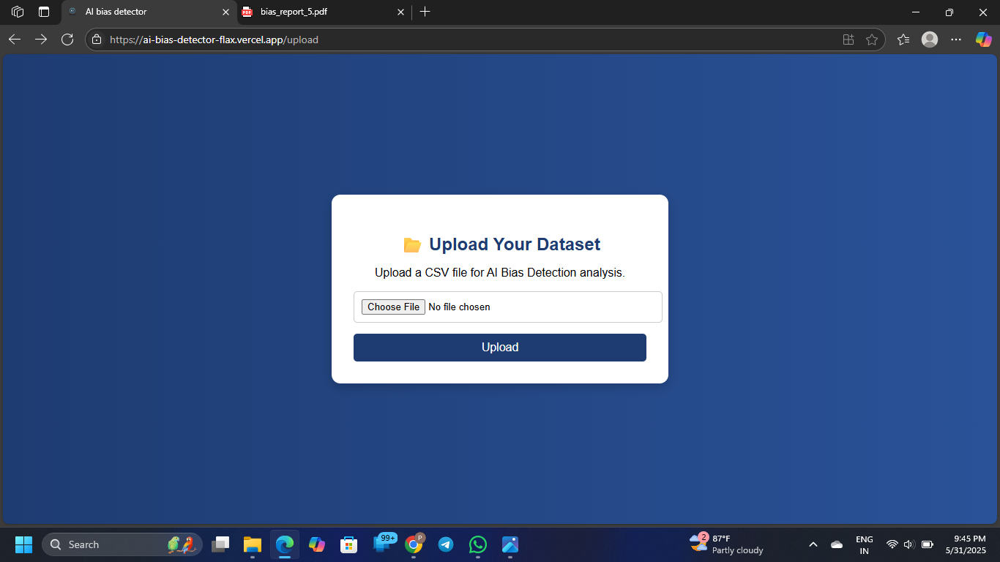
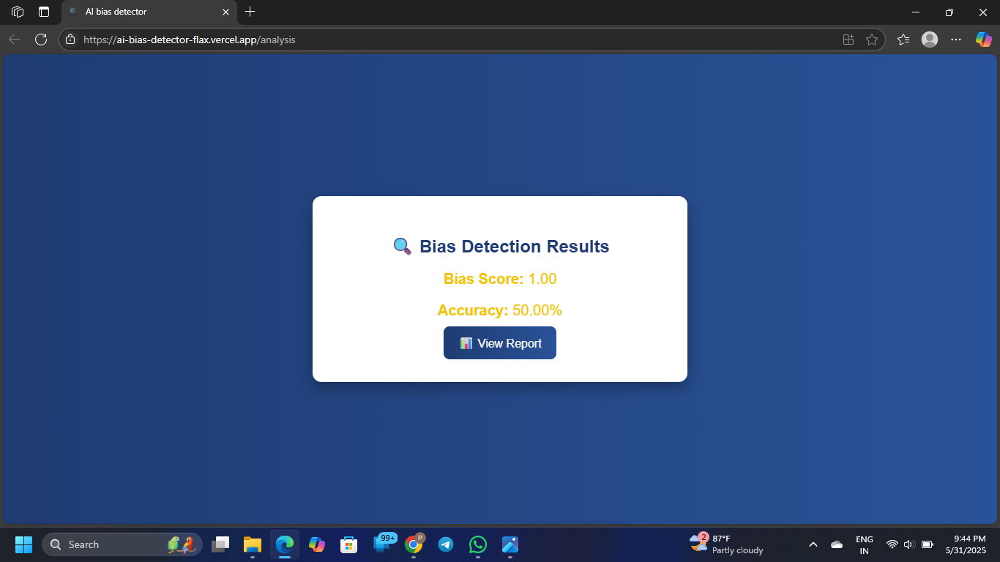
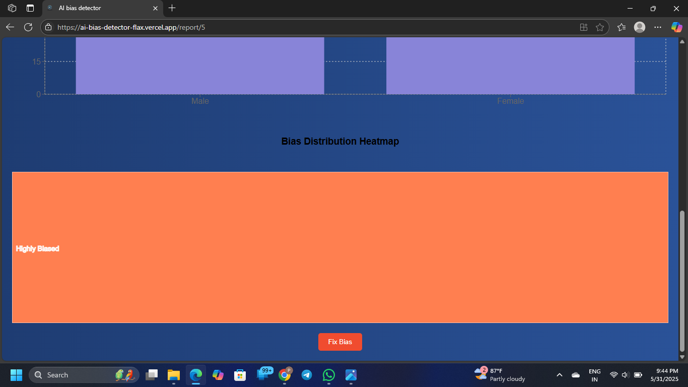
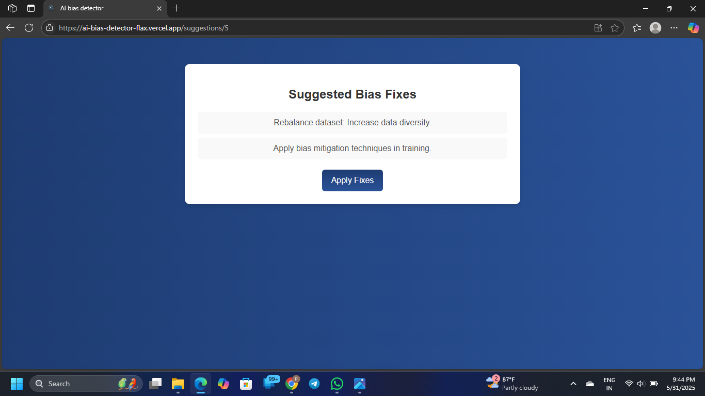
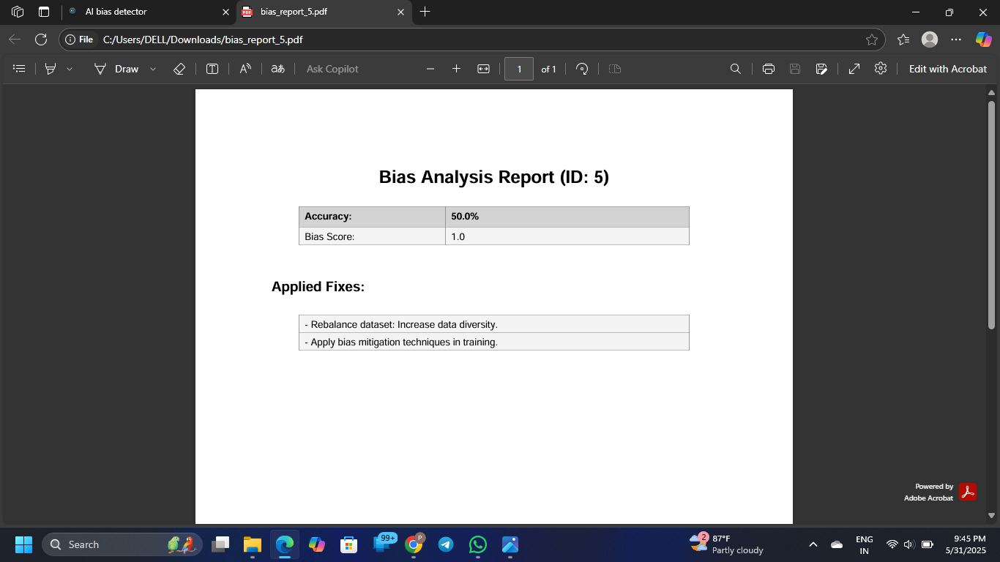

# 🧠 AI Dashboard for Data Bias and Report Analysis

This project is a full-stack web application designed to allow users to upload CSV datasets, detect and fix potential biases, view summarized PDF reports, and interact with data visualizations. It includes both frontend and backend implementations.

---

## 🚀 Features

- Upload CSV datasets for processing
- Automatically detect and suggest fixes for data bias
- Generate and view downloadable PDF reports
- Interactive visual analytics and charts
- Default Django admin panel for backend data management
- Frontend-backend integration using REST API

---

## 🛠 Tech Stack

**Frontend**:
- React.js
- Axios for API calls
- Recharts for visual reports
- HTML5, CSS3, Javascript

**Backend**:
- Django & Django REST Framework
- MySQL(for development), PostgreSQL (for production)
- Python 3.x

**Other Tools**:
- Git for version control
- Render, Neon, vercel for deployment

---

## 📁 Project Structure

```
project/
├── frontend/       # React or JavaScript frontend
├── backend/        # Django REST API backend
├── assets/
│   └── screenshots/
│       ├── screen1.png  # CSV Upload Page
│       ├── screen2.png  # Visual Reports Page
│       ├── screen3.png  # Fix Biases Page
│       ├── screen4.png  # PDF Report View
│       └── screen5.png  # Django Admin Panel
```

---

## 📸 Screenshots

### 📤 CSV Upload Page


### 🔐 Results Page


### 🛠 Fix Biases Page


### 📄 PDF Report Viewer


### 📊 Visual Reports Dashboard


---

## ⚙️ Frontend Setup

Navigate to the `frontend/` folder:

```bash
cd frontend
npm install
npm start
```

Make sure `.env` is properly configured for connecting to the backend API.

---

## ⚙️ Backend Setup (Django)

Navigate to the `backend/` folder:

```bash
cd backend
python -m venv venv
source venv/bin/activate  # or venv\Scripts\activate on Windows
pip install -r requirements.txt
python manage.py migrate
python manage.py runserver
```

To create a Django superuser:

```bash
python manage.py createsuperuser
```

Ensure `.env` is configured with proper Django settings like `SECRET_KEY`, `DEBUG`, and `DATABASE_URL`.

---

## 📝 License

This project is licensed under the MIT License – see the [LICENSE](LICENSE) file for details.

---

## 📬 Contact

For inquiries or support, please contact the development team or project maintainer.
